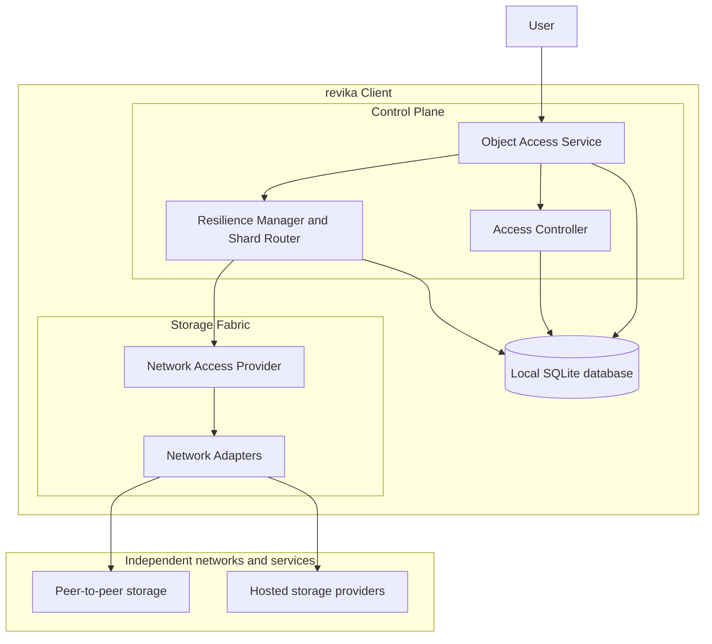
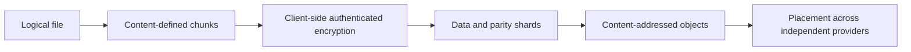

# revika

revika is an agnostic and modular storage fabric. It gives a User one coherent,
end-to-end encrypted namespace while connecting that namespace to several independent
storage networks and services.

The fabric may combine peer-to-peer networks, distributed storage systems, and hosted
storage services such as IPFS, Hyphanet, Freenet, Google Drive, Dropbox, or other
compatible providers. No provider is the centre of the system, and no storage Node is
trusted with plaintext or granted a privileged role.

## Vision

revika separates the meaning of data from the systems that carry it:

- the Client owns names, metadata, keys, capabilities, permissions, and consistency;
- the Control Plane turns files into protected, resilient objects;
- the Storage Fabric moves opaque encrypted objects through interchangeable adapters;
- Nodes and providers are responsible for availability, not confidentiality;
- several providers can be used at once to improve resilience and avoid dependence on one
  network.

The result is a storage system that can use different networks without changing the
User-facing namespace or the security model.

## Fabric model

### Control Plane

The Control Plane is the semantic and security boundary of revika. It manages logical
files and directories, encryption, capabilities, sharing roles, chunking, redundancy,
repair decisions, and consistency. It must remain independent from the protocols and
data models of external providers.

### Storage Fabric

The Storage Fabric is the interchangeable transport and storage boundary. A common
provider contract hides differences in addressing, authentication, quotas, latency,
eventual consistency, availability, and deletion semantics. Adding a provider must not
change the file model, encryption policy, sharing model, or conflict-management rules.

### Local state

All Client-side information shall be stored in a local SQLite database. This includes
metadata, manifests, encrypted key material, identities, capabilities, provider
configuration, placement state, synchronization anchors, vector clocks, CRDT operations,
repair state, and audit information. External providers store only opaque encrypted
objects and shards.

## Data protection

The logical storage flow is:

The Client keeps the information needed to reconstruct a file. A provider receives only
encrypted content and the minimum transport metadata required by its own service. Data
can be reconstructed when enough valid shards remain available, and missing shards can be
recreated without exposing the decryption key.

## Sharing and collaboration

Sharing transfers capabilities, not files. A capability can grant a recipient a selected
combination of Read, Write, and Delete permissions for a file or subtree. The underlying
encrypted objects remain in place, and the recipient receives only the protected
information needed for the granted scope.

Writable shared content requires explicit conflict management. Content-Defined Chunking
limits the impact of local edits. CRDTs merge compatible concurrent operations, while
vector clocks record causal relationships and distinguish causally ordered changes from
concurrent changes.

## Security constraints

- All cryptographic mechanisms shall be post-quantum compliant.
- Ed25519 is permitted only for signatures, as specified by the project requirements.
- Key establishment, capability wrapping, encryption-key delivery, authentication
  handshakes, and cryptographic protocol state must use post-quantum-compatible mechanisms.
- Cryptographic algorithms and formats must be versioned so that migrations do not silently
  invalidate stored data or capabilities.
- No waiver for non-post-quantum cryptography is currently approved.
- Any waiver must document its scope, justification, exposure, compensating controls,
  owner, approval date, expiry date, and removal criterion in
  [docs/Architecture.md](docs/Architecture.md).

The current PQC decision record and migration constraints are maintained in
[docs/Architecture.md](docs/Architecture.md).

## Architectural principles

### Least knowledge

The Client is the only trusted location for cleartext, file names, metadata, and
decryption keys. Nodes and providers are untrusted for confidentiality.

### Interchangeable Nodes

Every Node exposes the same conceptual role: storing and serving opaque encrypted data.
A bootstrap or discovery entry point may help a participant join a network, but it has no
special data or administrative privilege.

### Provider agnosticism

The same Control Plane can place data across multiple networks. Provider-specific
authentication, retries, rate limits, connectivity, and availability reporting stay in
adapters inside the Storage Fabric.

### No global authority

Signed roots, immutable content-addressed objects, capabilities, CRDTs, and vector clocks
provide integrity and collaborative consistency without making one Node authoritative for
all Users or all data.

## Requirements coverage

| Area | Architectural response |
| --- | --- |
| Least knowledge | Client-side protection; Nodes and providers receive opaque encrypted objects. |
| Node interchangeability | Common Node role and provider-neutral placement. |
| No privileged Node | Bootstrap entries are discovery aids only. |
| Post-quantum cryptography | PQC is mandatory; Ed25519 is limited to signatures. |
| Resilient file storage | Chunking, encryption, data/parity shards, and independent placement. |
| Sharing | Scoped Read, Write, and Delete capabilities. |
| Conflict management | CDC, CRDTs, and vector clocks for collaborative changes. |
| Discovery and reconnection | Provider adapters normalize changing availability and repair restores redundancy. |

## Documentation

- [Architecture](docs/Architecture.md)
- [Specifications](docs/Specifications.md)
- [Cloud storage model](docs/CloudStorage.md)
