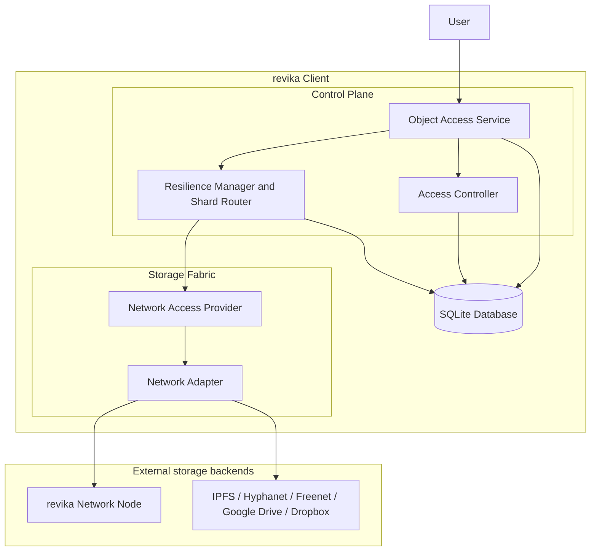
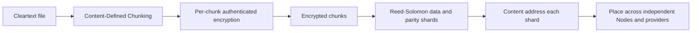
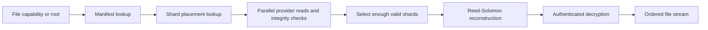

# revika Architecture

- [revika Architecture](#revika-architecture)
  - [1. Purpose and scope](#1-purpose-and-scope)
  - [2. Language and runtime choice](#2-language-and-runtime-choice)
  - [Constraints](#constraints)
    - [Post-quantum cryptography](#post-quantum-cryptography)
      - [Waiver process](#waiver-process)
  - [3. Architectural principles](#3-architectural-principles)
    - [3.1 Least knowledge](#31-least-knowledge)
    - [3.2 Interchangeable Nodes](#32-interchangeable-nodes)
    - [3.3 Control Plane versus Storage Fabric](#33-control-plane-versus-storage-fabric)
    - [3.4 Local decisions, distributed bytes](#34-local-decisions-distributed-bytes)
    - [3.5 Explicit state and monotonic history](#35-explicit-state-and-monotonic-history)
  - [4. Component structure](#4-component-structure)
    - [4.1 Object Access Service](#41-object-access-service)
    - [4.2 Access Controller](#42-access-controller)
    - [4.3 Resilience Manager and Shard Router](#43-resilience-manager-and-shard-router)
    - [4.4 Network Access Provider](#44-network-access-provider)
    - [4.5 Network Adapter](#45-network-adapter)
    - [4.6 SQLite database](#46-sqlite-database)
      - [SQLite schema](#sqlite-schema)
    - [4.7 Network Node](#47-network-node)
  - [5. Data and security model](#5-data-and-security-model)
    - [5.1 Store pipeline](#51-store-pipeline)
    - [5.2 Identities and authorization](#52-identities-and-authorization)
  - [6. Interfaces between layers](#6-interfaces-between-layers)
  - [7. Sharing and collaborative editing](#7-sharing-and-collaborative-editing)
    - [7.1 Read, write, and delete roles](#71-read-write-and-delete-roles)
    - [7.2 Content-Defined Chunking](#72-content-defined-chunking)
    - [7.3 CRDT and vector clocks](#73-crdt-and-vector-clocks)
  - [8. Discovery, reconnection, and repair](#8-discovery-reconnection-and-repair)
  - [9. Main operation flows](#9-main-operation-flows)
    - [9.1 Upload](#91-upload)
    - [9.2 Download](#92-download)
    - [9.3 Shared write](#93-shared-write)
    - [9.4 Delete and garbage collection](#94-delete-and-garbage-collection)
  - [10. Current implementation status](#10-current-implementation-status)
  - [11. Requirement traceability](#11-requirement-traceability)
  - [12. Design choices and trade-offs](#12-design-choices-and-trade-offs)
    - [Why client-side encryption?](#why-client-side-encryption)
    - [Why erasure coding instead of simple replication?](#why-erasure-coding-instead-of-simple-replication)
    - [Why content addressing?](#why-content-addressing)
    - [Why modular adapters?](#why-modular-adapters)
    - [Why no global consensus?](#why-no-global-consensus)
  - [13. Evolution and implementation order](#13-evolution-and-implementation-order)
  - [Related documents](#related-documents)

## 1. Purpose and scope

revika is a client-side, end-to-end encrypted storage system. A User runs a revika Client that stores files across several independent storage networks and services. The Client owns the file names, metadata, encryption keys, sharing capabilities, and consistency state. Remote Nodes and storage providers only receive opaque encrypted objects or shards.

The architecture is deliberately agnostic to the underlying network. A deployment may use one backend or several backends at the same time, including IPFS, Hyphanet, Freenet, Google Drive, Dropbox, or another provider implementing the revika storage contract. The Control Plane must not contain backend-specific logic. Network-specific behaviour belongs behind modular adapters in the Storage Fabric.

This document describes the target architecture and identifies the current implementation status. The normative requirements are listed in [Specifications.md](Specifications.md).

## 2. Language and runtime choice

The implementation language is **Go**.

Go is selected because it is compiled, produces self-contained binaries, and is well suited to networked and web services. A compiled binary simplifies deployment on a User machine or a headless Node and avoids requiring a language runtime on every installation. Go also provides:

- lightweight concurrency through goroutines and channels, useful for parallel shard transfers, health checks, repair, and provider operations;
- a strong standard library for cryptography, HTTP, serialization, filesystems, testing, and observability;
- good support for long-running services with explicit cancellation through `context.Context`;
- portability across Linux, macOS, Windows, and server architectures;
- a practical ecosystem for P2P networking, including `go-libp2p` and its QUIC and Kademlia implementations;
- straightforward interface-based dependency injection, which makes storage backends replaceable and testable.

Go is used for the portable core. The generic implementation and all shipped Go binaries must build and test with `CGO_ENABLED=0`. The generic core must not import `C`, depend on cgo-only packages, or require native operating-system bindings. Native operating-system cloud integrations are outside the generic implementation scope; if they are added later, they must remain separate thin translation shims and must not reimplement revika's storage, cryptography, or conflict logic.

## Constraints

### No cgo in the generic implementation

The generic revika implementation is cgo-free by design. Every core package, command, test, and
default build must work with `CGO_ENABLED=0`. CI shall test that mode explicitly, and dependencies
that require cgo are prohibited from the generic module. This keeps the control plane portable and
ensures that network-neutral storage, manifests, cryptography, synchronization, and local test
implementations do not depend on a platform toolchain.

Native bindings for macOS File Provider, Windows Cloud Filter, Linux GVfs/GIO, or another operating
system framework are not part of this implementation phase. They may be developed as separately
maintained translation layers in the future, but they must not move provider, manifest, encryption,
sharing, CRDT, or conflict logic across the generic boundary. IPFS, Hyphanet, Freenet, hosted-cloud,
DHT, and revika-network adapters are likewise excluded from the generic core and may only implement
the documented provider contracts in separate adapter packages.

### Post-quantum cryptography

All cryptographic mechanisms used by revika shall be post-quantum compliant. This applies to encryption, key encapsulation or key exchange, signatures except for the explicitly permitted Ed25519 signature case, hashing where it provides a security property, capability wrapping, authentication, and protocol handshakes.

The implementation shall therefore:

- use standardized post-quantum algorithms, preferably NIST-standardized algorithms, for key establishment and encryption-key delivery;
- preserve sufficient security margins for symmetric encryption and hashing against quantum search and collision attacks;
- isolate algorithms behind interfaces so migrations and algorithm updates do not change manifests or Object Access Service contracts without an explicit version transition;
- record the algorithm and version used for every persisted identity, capability, encrypted key, and cryptographic object;
- reject new persisted data that relies on a non-compliant algorithm unless an approved waiver is present;
- maintain interoperability tests for key rotation, capability wrapping, signatures, and recovery after an algorithm transition.

Ed25519 signatures are the only planned exception currently allowed by the functional specification. This exception must remain limited to signatures and must not be extended to key exchange, encryption, or capability confidentiality.

#### Waiver process

A waiver is required before shipping or expanding any non-PQC cryptographic mechanism. Each waiver shall be recorded in this document and in the README with:

1. the exact algorithm and affected component;
2. the reason no compliant replacement is currently usable;
3. the data, users, and interfaces exposed by the exception;
4. the compensating controls and migration plan;
5. an owner, approval date, expiry date, and removal criterion.

**Current waiver status: none approved.** The prototype currently contains AES-256-GCM and Ed25519. AES-256-GCM is retained as a symmetric prototype mechanism with a quantum security margin, and Ed25519 is explicitly permitted for signatures. No key-establishment or key-encapsulation mechanism is implemented yet: shared capabilities carry their encryption key in cleartext inside the signed capability blob (`internal/cap`), which is a compliance gap in capability confidentiality. A standardized PQC key-encapsulation mechanism such as ML-KEM must wrap that key before sharing can be considered compliant. This is a pending engineering decision, not an approved waiver.

## 3. Architectural principles

### 3.1 Least knowledge

The Client is the only component that needs to know the cleartext file, its name, its metadata, and its decryption keys. Nodes and external storage providers see encrypted, content-addressed data. A provider may know that it stores an object and may observe transport-level metadata, but it must not be able to reconstruct the file or interpret its contents.

### 3.2 Interchangeable Nodes

A Node is an untrusted blob store. It has no special data or role privilege. Every Node exposes the same storage contract, and any Node may be replaced, disconnected, reconnected, or removed. A bootstrap Node is only an entry point for joining discovery; it is not a coordinator, authority, or privileged storage location.

### 3.3 Control Plane versus Storage Fabric

The Client's Control Plane decides what an object means and how it is protected. The Storage Fabric decides how opaque bytes reach a selected backend. This separation allows new networks to be added without changing file encryption, sharing, manifests, or conflict management.

### 3.4 Local decisions, distributed bytes

The Client performs chunking, encryption, erasure coding, placement decisions, reconstruction, and permission checks locally. Distributed systems are used for transport, storage, discovery, and availability, not for exposing plaintext or granting a central server authority over a User's files.

### 3.5 Explicit state and monotonic history

Mutable namespace state is represented by signed root pointers and immutable content-addressed objects. Every accepted root advances a sequence number. Changes carry version information and, for collaborative editing, vector-clock causality. This makes stale writes observable and prevents a provider from silently rolling a namespace back.

## 4. Component structure

The Client is divided into a Control Plane, a Storage Fabric, and a local SQLite database. External Nodes and services are reached through the Storage Fabric.



The SQLite database is local to the Client. It is not a central database and is not authoritative for other Clients. External backends receive opaque encrypted objects only.

### 4.1 Object Access Service

The Object Access Service is the semantic entry point for file and object operations. It exposes a stable, backend-independent API to the CLI, daemon, filesystem mount, and future application integrations.

Responsibilities:

- create, read, update, delete, rename, and enumerate files and directories;
- resolve a path or opaque item identifier to a manifest entry;
- stream file content without exposing storage-provider details;
- return metadata, capabilities, versions, and errors in a platform-neutral form;
- publish a new namespace root after a successful mutation;
- provide change enumeration for filesystem and synchronization surfaces.

The existing `provider.Provider` contract is the intended shape for this boundary. Its operations include `Root`, `Stat`, `Lookup`, `Enumerate`, `FetchContents`, `CreateItem`, `ModifyItem`, `DeleteItem`, `Rename`, `CurrentAnchor`, and `EnumerateChanges`. Implementations must be safe for concurrent callers and must not require a native operating-system API.

The Object Access Service shall expose the following Go interface. The interface deliberately uses domain types instead of provider-specific types, so the CLI, daemon, filesystem adapters, and tests all use the same contract.

```go
type ObjectAccessService interface {
    Root(ctx context.Context) (ItemID, error)
    Stat(ctx context.Context, id ItemID) (Item, error)
    Lookup(ctx context.Context, parent ItemID, name string) (Item, error)
    Enumerate(ctx context.Context, directory ItemID) ([]Item, error)

    FetchContents(ctx context.Context, id ItemID, dst io.Writer) (ItemVersion, error)
    Create(ctx context.Context, parent ItemID, request CreateRequest) (Item, error)
    Modify(ctx context.Context, id ItemID, request ModifyRequest) (Item, error)
    Delete(ctx context.Context, id ItemID) error
    Rename(ctx context.Context, id ItemID, parent ItemID, name string) (Item, error)

    CurrentAnchor(ctx context.Context) (SyncAnchor, error)
    ChangesSince(ctx context.Context, anchor SyncAnchor) (ChangeSet, error)
}

type ItemID string

type Item struct {
    ID      ItemID
    Parent  ItemID
    Name    string
    IsDir   bool
    Size    int64
    Version ItemVersion
    Meta    Metadata
    Caps    Capabilities
}

type CreateRequest struct {
    Name     string
    IsDir    bool
    Meta     Metadata
    Contents io.Reader
}

type ModifyRequest struct {
    Contents io.Reader
    Meta     *Metadata
}

type ItemVersion struct {
    Content []byte
    Meta    []byte
}

type SyncAnchor struct {
    Sequence uint64
    RootID   string
}

type ChangeSet struct {
    Changes []Change
    Anchor  SyncAnchor
}
```

`Create`, `Modify`, `Delete`, and `Rename` are authorized by the Access Controller and commit through a signed, monotonically increasing root. `FetchContents` streams cleartext only to a trusted local caller after the capability check; cleartext must never be passed to a Network Adapter.

### 4.2 Access Controller

The Access Controller owns identity, capabilities, authorization, and sharing policy. It runs on the Client side and is the only component that can use the User's private keys.

Responsibilities:

- load and protect the User's signing and key-agreement or KEM identities;
- create read, write, and delete capabilities for a file or subtree;
- verify signatures and capability scope before an operation;
- wrap a capability for a recipient without copying the underlying shards;
- enforce that a capability is valid for the requested object and operation;
- authenticate ownership of mutable roots and shard ownership metadata.

A shared capability should identify the object or root, the permitted operations, the relevant encryption material, the issuer, the recipient, and an expiry or revocation policy if one is introduced. The capability itself is sensitive because it may contain or unlock decryption keys; it must be treated as secret local state.

### 4.3 Resilience Manager and Shard Router

The Resilience Manager and Shard Router translate a logical encrypted chunk into an availability plan across Nodes and providers.

Responsibilities:

- select a chunking policy, including Content-Defined Chunking (CDC);
- encrypt each chunk before it leaves the Client;
- generate data and parity shards using Reed-Solomon erasure coding;
- select multiple independent placement targets;
- route `PUT`, `GET`, `HAS`, and `DELETE` operations through the Storage Fabric;
- probe shard availability and integrity;
- reconstruct a chunk when enough valid shards are available;
- regenerate missing or corrupted shards without decrypting the chunk;
- migrate or rebalance placement when a provider becomes unavailable.

The default RAID6-like model is `k` data shards plus `m` parity shards. Any `k` valid shards reconstruct the encrypted chunk, so the loss of Nodes or corrupted shards does not necessarily interrupt retrieval. The router must never assume that a provider or Node is permanent.

### 4.4 Network Access Provider

The Network Access Provider is the backend-neutral storage interface used by the Control Plane. It represents capabilities such as storing, retrieving, probing, and deleting opaque objects, while hiding how a backend reaches those objects.

A conceptual Go-shaped contract is:

```go
type NetworkAccessProvider interface {
    Put(ctx context.Context, object Object) error
    Get(ctx context.Context, id ObjectID) (io.ReadCloser, error)
    Has(ctx context.Context, id ObjectID) (bool, error)
    Delete(ctx context.Context, id ObjectID) error
    Probe(ctx context.Context, id ObjectID) (Proof, error)
    Availability(ctx context.Context) Availability
    Close() error
}
```

The exact public API may evolve, but the contract must preserve these properties:

- object identifiers and bytes are opaque to the backend-neutral layer;
- operations accept cancellation and deadlines;
- transient failures are distinguishable from permanent absence;
- reads can be streamed;
- provider health and capacity can be reported to placement;
- provider-specific credentials stay inside the adapter;
- implementations can be composed into a pool of providers.

A provider is not trusted with file semantics. It must not decide permissions, merge edits, interpret a path, or publish a User's root pointer.

### 4.5 Network Adapter

A Network Adapter implements the Network Access Provider contract for one protocol or service. Examples include:

- an IPFS adapter using content-addressed blocks and the available IPFS transport;
- a Hyphanet adapter using Hyphanet's storage and retrieval API;
- a Freenet adapter using Freenet's insert and fetch model;
- a Google Drive adapter using an authenticated object/file API;
- a Dropbox adapter using its authenticated file API;
- a native revika/libp2p adapter for revika Nodes and Kademlia discovery.

Adapters may differ in latency, object-size limits, naming, authentication, eventual consistency, quota, availability, and delete semantics. The adapter must normalize those differences into the common contract and report limitations rather than leaking them into the Control Plane.

Multiple adapters can be active simultaneously. A placement policy can use provider capabilities, geographic or administrative diversity, cost, observed health, and redundancy requirements to choose targets. Adding a new adapter must require only the adapter and its tests; it must not change encryption, manifest formats, sharing, CRDT logic, or the Object Access Service.

### 4.6 SQLite database

**All Client-side information shall be stored in a local SQLite database.** This includes operational state, metadata, manifests, capabilities, identities, provider configuration, synchronization state, repair state, and audit information. The database is the single persistence boundary for the Client. In-memory structures may be used as caches, but they must be reconstructible from SQLite and must not be the only copy of Client-owned information.

The SQLite database file must be protected with filesystem permissions restricted to the User. Sensitive values such as private keys, capabilities, root pointers, and encrypted file keys must be stored in protected columns or encrypted before insertion. SQLite foreign keys shall be enabled for every connection, and schema changes shall be applied through numbered migrations.

The database stores Client-owned state needed to operate without a central coordinator:

- signed root pointers and their monotonic sequence numbers;
- file and directory manifests;
- encrypted chunk and shard references;
- metadata and stable item identifiers;
- capabilities and local sharing records;
- vector clocks and CRDT state for collaborative files;
- provider bindings, health observations, and placement records;
- synchronization anchors and repair work queues.

Its contents must be protected because manifests, root pointers, and capabilities may contain keys or references that authorize access. Database corruption must be detectable through signatures, hashes, and consistency checks. Remote shards and provider-managed bytes are not duplicated as cleartext in SQLite; the database stores their encrypted references and placement metadata.

#### SQLite schema

The following schema is the logical minimum. Implementations may add columns through migrations, but must preserve the meaning of these tables and constraints.

```sql
PRAGMA foreign_keys = ON;

CREATE TABLE identities (
    id              TEXT PRIMARY KEY,
    kind            TEXT NOT NULL CHECK (kind IN ('signing', 'kem', 'encryption')),
    public_key      BLOB NOT NULL,
    private_key     BLOB NOT NULL,
    algorithm       TEXT NOT NULL,
    created_at_ns   INTEGER NOT NULL,
    active          INTEGER NOT NULL DEFAULT 1 CHECK (active IN (0, 1))
);

CREATE TABLE root_pointers (
    id              INTEGER PRIMARY KEY CHECK (id = 1),
    owner_identity  TEXT NOT NULL REFERENCES identities(id),
    sequence        INTEGER NOT NULL,
    root_cap        BLOB NOT NULL,
    signature       BLOB NOT NULL,
    created_at_ns   INTEGER NOT NULL,
    CHECK (sequence >= 0)
);

CREATE TABLE items (
    id              TEXT PRIMARY KEY,
    parent_id       TEXT REFERENCES items(id) ON DELETE CASCADE,
    name            TEXT NOT NULL,
    kind            TEXT NOT NULL CHECK (kind IN ('file', 'directory', 'symlink')),
    size_bytes      INTEGER NOT NULL DEFAULT 0 CHECK (size_bytes >= 0),
    mode            INTEGER,
    metadata_blob   BLOB NOT NULL,
    content_version BLOB NOT NULL,
    metadata_version BLOB NOT NULL,
    manifest_id     TEXT,
    created_at_ns   INTEGER NOT NULL,
    modified_at_ns  INTEGER NOT NULL,
    deleted_at_ns   INTEGER,
    UNIQUE (parent_id, name)
);

CREATE TABLE manifests (
    id              TEXT PRIMARY KEY,
    item_id         TEXT NOT NULL REFERENCES items(id) ON DELETE CASCADE,
    manifest_blob   BLOB NOT NULL,
    content_hash    BLOB NOT NULL UNIQUE,
    created_at_ns   INTEGER NOT NULL
);

CREATE TABLE chunks (
    id              TEXT PRIMARY KEY,
    manifest_id     TEXT NOT NULL REFERENCES manifests(id) ON DELETE CASCADE,
    ordinal         INTEGER NOT NULL CHECK (ordinal >= 0),
    offset_bytes    INTEGER NOT NULL CHECK (offset_bytes >= 0),
    plaintext_size  INTEGER NOT NULL CHECK (plaintext_size >= 0),
    ciphertext_size INTEGER NOT NULL CHECK (ciphertext_size >= 0),
    encryption_key  BLOB NOT NULL,
    nonce           BLOB NOT NULL,
    content_hash    BLOB NOT NULL,
    UNIQUE (manifest_id, ordinal),
    UNIQUE (manifest_id, content_hash)
);

CREATE TABLE providers (
    id              TEXT PRIMARY KEY,
    kind            TEXT NOT NULL,
    configuration   BLOB NOT NULL,
    capabilities    BLOB NOT NULL,
    enabled         INTEGER NOT NULL DEFAULT 1 CHECK (enabled IN (0, 1)),
    last_seen_ns    INTEGER,
    health          TEXT NOT NULL DEFAULT 'unknown'
                    CHECK (health IN ('unknown', 'healthy', 'degraded', 'offline')),
    created_at_ns   INTEGER NOT NULL
);

CREATE TABLE shards (
    id              TEXT PRIMARY KEY,
    chunk_id        TEXT NOT NULL REFERENCES chunks(id) ON DELETE CASCADE,
    provider_id     TEXT NOT NULL REFERENCES providers(id),
    shard_index     INTEGER NOT NULL CHECK (shard_index >= 0),
    shard_kind      TEXT NOT NULL CHECK (shard_kind IN ('data', 'parity')),
    size_bytes      INTEGER NOT NULL CHECK (size_bytes >= 0),
    content_hash    BLOB NOT NULL,
    state           TEXT NOT NULL DEFAULT 'pending'
                    CHECK (state IN ('pending', 'available', 'missing', 'corrupt', 'deleted')),
    last_verified_ns INTEGER,
    UNIQUE (chunk_id, shard_index, provider_id)
);

CREATE TABLE capabilities (
    id              TEXT PRIMARY KEY,
    item_id         TEXT NOT NULL REFERENCES items(id) ON DELETE CASCADE,
    issuer_identity  TEXT NOT NULL REFERENCES identities(id),
    recipient_key    BLOB,
    permissions      INTEGER NOT NULL CHECK (permissions > 0),
    capability_blob  BLOB NOT NULL,
    expires_at_ns    INTEGER,
    revoked_at_ns    INTEGER,
    created_at_ns    INTEGER NOT NULL
);

CREATE TABLE vector_clocks (
    item_id         TEXT NOT NULL REFERENCES items(id) ON DELETE CASCADE,
    actor_id        TEXT NOT NULL,
    counter         INTEGER NOT NULL CHECK (counter >= 0),
    PRIMARY KEY (item_id, actor_id)
);

CREATE TABLE crdt_operations (
    id              TEXT PRIMARY KEY,
    item_id         TEXT NOT NULL REFERENCES items(id) ON DELETE CASCADE,
    actor_id        TEXT NOT NULL,
    operation_blob  BLOB NOT NULL,
    operation_hash  BLOB NOT NULL UNIQUE,
    applied         INTEGER NOT NULL DEFAULT 0 CHECK (applied IN (0, 1)),
    created_at_ns   INTEGER NOT NULL
);

CREATE TABLE sync_anchors (
    id              TEXT PRIMARY KEY,
    surface         TEXT NOT NULL,
    sequence        INTEGER NOT NULL CHECK (sequence >= 0),
    root_id         TEXT NOT NULL,
    anchor_blob     BLOB NOT NULL,
    updated_at_ns   INTEGER NOT NULL,
    UNIQUE (surface)
);

CREATE TABLE repair_jobs (
    id              INTEGER PRIMARY KEY AUTOINCREMENT,
    shard_id        TEXT NOT NULL REFERENCES shards(id) ON DELETE CASCADE,
    provider_id     TEXT REFERENCES providers(id),
    state           TEXT NOT NULL DEFAULT 'queued'
                    CHECK (state IN ('queued', 'running', 'completed', 'failed')),
    attempts        INTEGER NOT NULL DEFAULT 0 CHECK (attempts >= 0),
    last_error      TEXT,
    created_at_ns   INTEGER NOT NULL,
    updated_at_ns   INTEGER NOT NULL
);

CREATE INDEX items_parent_idx ON items(parent_id);
CREATE INDEX chunks_manifest_idx ON chunks(manifest_id, ordinal);
CREATE INDEX shards_chunk_idx ON shards(chunk_id);
CREATE INDEX shards_provider_idx ON shards(provider_id, state);
CREATE INDEX capabilities_item_idx ON capabilities(item_id);
CREATE INDEX crdt_operations_item_idx ON crdt_operations(item_id, created_at_ns);
CREATE INDEX repair_jobs_state_idx ON repair_jobs(state, updated_at_ns);
```

The principal relationships are:

- one `item` has zero or one active `manifest`; a directory item may instead reference child items through `parent_id`;
- one `manifest` contains ordered `chunks`, and each chunk has multiple data or parity `shards`;
- each shard is assigned to a `provider`, while its bytes remain encrypted outside the database;
- capabilities authorize access to items and are issued by an identity;
- vector-clock entries and CRDT operations belong to an item;
- synchronization surfaces persist their last opaque anchor in `sync_anchors`;
- failed or degraded shard placements create `repair_jobs`.

### 4.7 Network Node

A Network Node stores encrypted shards and serves protocol requests. It is not a Client and does not need access to file names, manifests, encryption keys, or sharing roles.

A Node provides:

- durable storage for opaque content-addressed blobs;
- authenticated transport and request authorization for shard ownership operations;
- `PUT`, `GET`, `HAS`, `DELETE`, and probe operations;
- availability across restarts;
- clean handling of disk-full, missing-object, corruption, and shutdown conditions.

Node implementations must remain interchangeable. A Node may run on the same machine as a Client, but co-location must not create an architectural privilege.

## 5. Data and security model

### 5.1 Store pipeline

The logical store operation is:



The Client keeps the manifest that maps the logical file to ordered encrypted chunks and shard identifiers. Nodes receive only the final shard bytes and their content identifiers. A shard can be repaired from other shards without learning the encryption key.

The read path reverses the process:



Authenticated encryption must reject tampered ciphertext. Hashes and content addresses detect wrong or corrupted shard bytes. Cryptographic routines must remain replaceable by post-quantum-compatible implementations. Signatures may use Ed25519 as permitted by PLK004; encryption and key encapsulation must not depend on non-PQC primitives where the requirement applies.

### 5.2 Identities and authorization

The User's identity has two distinct purposes:

- a signing identity, currently Ed25519, for authenticating roots, ownership, and authorized mutations;
- a recipient/encryption identity, such as ML-KEM for future-proof capability delivery, for receiving shared access.

A signed root pointer binds the owner, sequence, timestamp, and root capability. A RootStore must reject a root that is not owned by the local signing identity or does not advance the stored sequence. This makes stale state and rollback attempts visible.

Sharing wraps capabilities rather than copying data. Client A sends Client B a capability for a file or subtree, limited to a combination of Read, Write, and Delete permissions. The shards remain where they are, and Nodes do not learn that sharing occurred beyond observable transport metadata.

## 6. Interfaces between layers

| Boundary | Contract | Data crossing the boundary | Must not cross |
| --- | --- | --- | --- |
| Application/daemon -> Object Access Service | file and metadata operations | paths or opaque item IDs, streams, metadata, versions, capabilities | provider-specific protocol details |
| Object Access Service -> Access Controller | authorization and capability operations | identity, requested action, object scope, role | cleartext to storage adapters |
| Object Access Service -> Resilience Manager | logical content operations | manifests, encrypted chunks, shard plans | provider credentials |
| Resilience Manager -> Network Access Provider | blob operations | opaque object IDs, encrypted shard streams, probes | file names, cleartext, decryption keys |
| Network Access Provider -> Network Adapter | normalized backend calls | opaque objects, deadlines, health policy | revika file semantics |
| Network Adapter -> Network Node/service | backend protocol | encrypted objects and transport authentication | manifests and plaintext |
| Control Plane -> Database | durable local state | roots, manifests, capabilities, clocks, placement state | unencrypted secrets outside protected storage |

The interfaces are intentionally narrow. A test can replace every external network with an in-memory provider, while a production Client can combine several adapters without changing the Control Plane.

## 7. Sharing and collaborative editing

### 7.1 Read, write, and delete roles

A capability carries a set of operations. Read permits resolving the manifest and decrypting content. Write permits proposing a new version and publishing an authorized update. Delete permits removing the logical entry or publishing a tombstone, subject to the owner's policy. The Access Controller checks these roles before the Object Access Service invokes a mutation.

The owner remains responsible for defining whether a recipient may re-share a capability, modify metadata, rename an entry, or alter descendants of a shared directory. These permissions should be explicit rather than inferred from network reachability.

### 7.2 Content-Defined Chunking

CDC is required because fixed chunk boundaries cause a small insertion to rewrite every subsequent chunk. A rolling or equivalent content-defined boundary algorithm keeps most unchanged regions addressed by the same chunk IDs after an edit. This reduces network traffic, preserves deduplication, and limits the scope of conflict resolution.

CDC is implemented. `internal/pipeline` splits input with a content-defined, rolling-hash chunker (configurable minimum, average, and maximum sizes), so localized edits keep unchanged regions on stable boundaries. Cross-version compatibility rules for the on-disk chunk format remain to be finalized.

### 7.3 CRDT and vector clocks

A shared writable file needs a deterministic way to represent concurrent edits. The target design uses:

- a CRDT appropriate to the file representation, such as a sequence CRDT for text or a map/set CRDT for structured metadata;
- a vector clock attached to each logical version or operation to record causal history;
- immutable operation or version records addressed by content;
- deterministic merge rules that do not require a central lock;
- a conflict-copy or explicit unresolved-conflict result when the file format cannot safely merge two changes.

Vector clocks distinguish a causally newer update from concurrent updates. The CRDT merges concurrent operations where its data model permits it. The Object Access Service then publishes the merged result as a new signed root, while retaining enough history to audit or recover a prior version.

CRDT, vector-clock tracking, and full collaborative write conflict management are target capabilities. The current repository has root/version and provider foundations, but the complete shared-write synchronization engine is planned.

## 8. Discovery, reconnection, and repair

Node and provider availability is expected to change. The Storage Fabric therefore treats availability as a dynamic property rather than a fixed configuration.

1. A Client starts with configured bootstrap addresses or provider credentials.
2. The native revika adapter joins the libp2p/Kademlia network. A bootstrap Node only helps the Client enter discovery.
3. The Client discovers providers or Nodes and records their capabilities and health.
4. The Shard Router places new shards across independent targets.
5. On a timeout, disconnect, failed probe, or corrupted shard, the Resilience Manager marks the target unavailable and tries alternate targets.
6. Once enough valid shards are read, the Client reconstructs the chunk and can regenerate replacement shards to healthy targets.
7. A reconnected or newly joined Node can receive repaired or newly placed shards. It does not receive privileged metadata or historical plaintext.

Provider-specific reconnection, retry, backoff, rate limits, and session renewal stay in the Network Adapter. The common layer sees normalized temporary and permanent errors and can make a placement or repair decision.

## 9. Main operation flows

### 9.1 Upload

1. The Object Access Service validates the destination capability and metadata.
2. The chunker divides the file using CDC in the target implementation.
3. The crypto layer encrypts each chunk with authenticated encryption and fresh key material.
4. The Resilience Manager generates data and parity shards.
5. The Shard Router asks the provider pool for independent targets.
6. Adapters upload opaque shards and return durable object identifiers.
7. The Client writes a file manifest and updates the directory DAG.
8. The Access Controller signs a new monotonic root pointer.
9. The Database persists the root and synchronization anchor.

A failed upload is not visible as a complete namespace mutation until the manifest and root are committed. Orphaned encrypted shards can be garbage-collected later by a controlled maintenance process.

### 9.2 Download

The Object Access Service resolves the capability, reads the manifest, and asks the Shard Router to fetch shards in parallel. The router validates identifiers and proofs, uses any sufficient set of valid shards to reconstruct each encrypted chunk, decrypts and authenticates it locally, and streams the resulting bytes to the caller.

### 9.3 Shared write

The recipient presents a write capability. The Client reads the current manifest and vector clock, creates CDC chunks for the changed content, and records the new CRDT operations or version. If the root has advanced, the Client merges causally compatible changes or produces an explicit conflict result. The accepted result receives a new signed root and is published through the same storage pipeline.

### 9.4 Delete and garbage collection

Delete first changes the logical manifest by publishing a tombstone or removing the entry. Physical shard deletion is deferred until the Client can prove that no live manifest, capability policy, or retention rule still references the shard. Each backend's delete semantics are normalized by its adapter.

## 10. Current implementation status

The repository currently contains the first pure-Go foundation of the generic core. Network,
daemon, and native operating-system components are intentionally not implemented here:

| Area | Current status |
| --- | --- |
| Go module and cgo-free CI | Implemented with `CGO_ENABLED=0` test and vet checks |
| Opaque object stores | Implemented with pure-Go memory and disk stores |
| Signing boundary | Implemented with versioned Ed25519 signing; Ed25519 remains signature-only |
| Content-defined chunking | Initial deterministic CDC implementation and tests |
| Provider contract and sync anchors | Types and serialization implemented; pure-Go in-memory reference provider implemented |
| Immutable content-addressed manifest nodes | Implemented with deterministic encoding, SHA-256 addressing, validation, and generic object-store persistence |
| Persistent manifest provider | Initial snapshot-backed provider implemented with signed roots and reopen support; the snapshot currently serializes item state (including cleartext contents) directly to the object store, so wiring persistence through the encryption/erasure pipeline and full COW DAG mutations remain planned |
| Mutable roots | Signed monotonic memory and atomic file-backed root stores implemented; network publication excluded |
| Client-side authenticated encryption | AES-256-GCM chunk protection implemented behind a versioned API; PQC key delivery remains planned |
| Erasure coding | Reed-Solomon data/parity encoding, integrity checks, and reconstruction implemented |
| Sharing capabilities | Signed scoped Read/Write/Delete capabilities implemented; capability key is currently cleartext inside the signed blob; PQC recipient wrapping remains planned |
| CRDTs and vector clocks | Vector-clock comparison/merge and deterministic text CRDT implemented |
| SQLite persistence | Pure-Go SQLite schema (identities, root pointers, items, manifests, chunks, providers, shards, capabilities, vector clocks, CRDT operations, sync anchors, repair jobs) and numbered-migration runner implemented |
| Synchronization | Injectable anchor-driven sync engine implemented; filesystem watchers and conflict-copy surfaces remain planned |
| Placement and repair | Failure-domain-aware target selection and ciphertext-only shard repair implemented |
| Background daemon | Cancellable pure-Go lifecycle coordinator implemented; network wiring remains excluded |
| FUSE | Explicitly excluded from this implementation phase |
| Native OS bindings and network adapters | Explicitly excluded from this implementation phase |

The status table is intentionally conservative. A target interface can be specified before every implementation behind it exists.

## 11. Requirement traceability

| Requirement | Architectural answer | Status |
| --- | --- | --- |
| PLK001 | Nodes implement the same opaque blob contract; placement tolerates replacement and multiple providers. | Implemented in principle; broader provider pool planned |
| PLK002 | No Node owns a special role. Bootstrap peers only provide DHT entry and discovery. | Implemented by design; DHT discovery expansion planned |
| PLK003 | All content is encrypted at the Client before shard upload; Nodes store ciphertext only. | Implemented |
| PLK004 | Crypto is isolated behind replaceable interfaces; encryption/key encapsulation must be PQC-compatible, with Ed25519 allowed for signatures. | Partially implemented; current prototype uses AES-256-GCM and Ed25519, PQC migration/coverage continues |
| ITM001 | Files become chunks, encrypted chunks become RAID6-like data/parity shards, and shards are distributed across independent targets. | Core implemented (CDC, encryption, erasure coding); end-to-end pipeline wiring into the provider and multi-provider placement planned |
| SHR001 | A capability can identify one file or subtree and be wrapped for another Client. | Initial read sharing implemented |
| SHR002 | Access Controller capabilities carry explicit Read, Write, and Delete roles. | Design specified; full role enforcement planned |
| SHR003 | Writable shared objects use CRDT merge, vector-clock causality, and explicit conflict handling. | Planned |
| SHR004 | CDC preserves stable chunk boundaries across localized edits. | Implemented; rolling-hash content-defined chunker in `internal/pipeline` |
| SHR005 | A file representation-specific CRDT merges concurrent operations without a central coordinator. | Planned |
| SHR006 | Vector clocks record causal relationships between modifications. | Planned |
| DCV001 | Provider adapters normalize disconnects, retries, reconnection, discovery, and new target onboarding; repair restores redundancy. | Partially implemented; complete seamless multi-provider discovery planned |

## 12. Design choices and trade-offs

### Why client-side encryption?

It preserves confidentiality even when a Node, cloud account, or transport provider is compromised. It also lets heterogeneous providers be treated as interchangeable byte stores. The trade-off is that the Client must manage keys, manifests, and repair decisions, and a lost capability may make data unrecoverable.

### Why erasure coding instead of simple replication?

Reed-Solomon parity provides storage efficiency while tolerating missing or corrupted shards. It costs CPU and coordination during repair, so repair is asynchronous and the router must avoid placing all shards in one failure domain.

### Why content addressing?

Content addressing makes immutable objects verifiable, enables deduplication, permits unchanged chunks to survive edits, and lets repair regenerate a known object. It does not replace authorization: possession of an identifier must not by itself grant access to the decryption key.

### Why modular adapters?

No single network offers the best availability, performance, cost, jurisdiction, or operational model for every User. A common adapter contract lets revika combine P2P and cloud storage while keeping its security and consistency model stable. The trade-off is that adapters must carefully normalize very different consistency, quota, and deletion semantics.

### Why no global consensus?

A central consensus layer would introduce a privileged coordination role and make availability dependent on a global service. Signed roots, monotonic sequence numbers, content-addressed manifests, CRDTs, and vector clocks provide the needed local and collaborative consistency without making any Node authoritative for all data.

## 13. Evolution and implementation order

The recommended implementation order is:

1. complete the networked or disk-backed `RootStore` and persistent Client state;
2. finish CDC and define stable file-manifest compatibility rules;
3. implement placement across a pool of interchangeable providers;
4. add the FUSE proof of concept and background daemon;
5. implement synchronization, CRDT state, vector clocks, and conflict-copy behaviour;
6. add thin native filesystem bindings;
7. add and validate adapters for IPFS, Hyphanet, Freenet, Google Drive, Dropbox, and other providers;
8. add maintenance, rebalancing, observability, and long-term garbage collection.

Each step should preserve the core boundary: Control Plane components operate on logical objects and opaque shard contracts, while adapters handle the details of the external network.

## Related documents

- [Specifications](Specifications.md)
- [Cloud storage and daemon contract](CloudStorage.md)
- [Project overview and current package status](../README.md)
